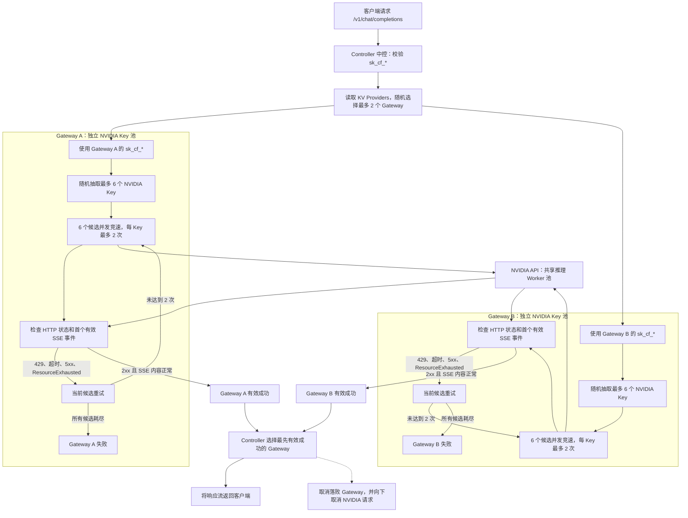

# NVIDIA Gateway

基于 Cloudflare Workers + Hono 的 OpenAI-compatible 代理网关。它可以直接作为 NVIDIA 多 Key 竞速网关，也可以部署成中控，让多个下游 gateway 之间继续竞速。

客户端始终请求 `/v1/*`，请求体里的 `model` 使用真实模型 ID，例如 `deepseek-ai/deepseek-v4-flash`。

## 两种角色

### 下游 Gateway

下游 gateway 直接连 NVIDIA：

```text
Client / Controller
  -> Gateway
    -> NVIDIA API
```

后台 Provider 配置：

```text
API 地址：https://integrate.api.nvidia.com/v1
API Key：NVIDIA 公益 key
```

### 中控 Controller

中控不保存 NVIDIA key，只保存下游 gateway 地址和下游 gateway 生成的 `sk_cf_*`：

```text
Client
  -> Controller
    -> gateway-1
    -> gateway-2
    -> gateway-3
      -> NVIDIA API
```

后台 Provider 配置：

```text
API 地址：https://gateway-1.example.com/v1
API Key：gateway-1 后台生成的 sk_cf_*
```

同一套代码决定角色的方式是后台 Provider 配置，不是环境变量。Provider 指向 NVIDIA，它就是下游 gateway；Provider 指向其他 gateway，它就是中控。

## 特性

- 多 upstream 竞速：每次请求从启用的 provider/key 候选中随机抽取若干个并发请求。
- 候选独立 baseUrl：每个 `provider + key` 都使用自己的 `baseUrl`，适合中控转发到多个 gateway。
- 单候选有限重试：过滤 `429`、超时、网络错误、常见 `5xx`、`ResourceExhausted` 等瞬时错误。
- 200 业务错误过滤：如果上游返回 `HTTP 200`，但 SSE/响应开头包含 `ResourceExhausted` 或 `data: {"error": ...}`，不会算作胜出。
- 流式响应透传：胜出的响应会继续流式返回给客户端，未胜出请求会被取消。
- 转发 Key 认证：客户端使用后台生成的 `sk_cf_*` 访问本代理。
- Debug 日志：默认关闭；打开后记录最近 20 条竞速成功/失败日志和响应开头 preview。
- 数据导入导出：后台可导出/导入 provider 和 proxy key 配置。

## 原理图



## 竞速参数

推荐使用新的 `UPSTREAM_RACE_*` 变量。旧的 `NVIDIA_RACE_*` 仍兼容。

| 变量 | 默认值 | 说明 |
| --- | ---: | --- |
| `UPSTREAM_RACE_MAX_KEYS` | `6` | 每个请求最多并发竞速的候选数。 |
| `UPSTREAM_RACE_PER_KEY_RETRIES` | `2` | 每个候选最多尝试次数。注意是总尝试次数，不是额外 retry 次数。 |
| `UPSTREAM_RACE_ATTEMPT_TIMEOUT_MS` | `6000` | 单次上游请求超时时间。 |
| `UPSTREAM_RACE_OVERALL_TIMEOUT_MS` | `30000` | 整轮竞速总超时时间。 |

下游 gateway 可以不设置，默认就是 `6 x 2`。中控建议保守一点：

```text
UPSTREAM_RACE_MAX_KEYS=2
UPSTREAM_RACE_PER_KEY_RETRIES=1
UPSTREAM_RACE_ATTEMPT_TIMEOUT_MS=8000
UPSTREAM_RACE_OVERALL_TIMEOUT_MS=20000
```

## Cloudflare 部署

建议用 Cloudflare Workers Git 部署，不要按普通静态 Pages 项目部署。

1. 进入 Cloudflare Dashboard。
2. 打开 **Workers & Pages**。
3. 创建应用时选择 **Worker / Import a repository**。
4. 连接 GitHub，选择仓库。
5. 构建配置：

| 配置项 | 填写 |
| --- | --- |
| Root directory | 留空，或填 `/` |
| Build command | 留空 |
| Deploy command | 见下面的多部署命令表 |

如果界面要求 Build command 不能空，也可以填对应 env 的 dry-run，例如 gateway-1：

```bash
npx wrangler deploy --dry-run --env gateway1 --keep-vars
```

本仓库的 `build` 是默认环境的 `wrangler deploy --dry-run`，只做打包检查。多 gateway / controller 部署时，建议直接在 Cloudflare 项目里分别填写完整的 `npx wrangler deploy --env ...`。

### 多部署命令

如果多个 Worker 都连接同一个 GitHub 仓库，每个 Cloudflare Worker 项目的 Deploy command 必须不一样：

| Worker 项目 | Deploy command |
| --- | --- |
| `ai-gateway-navdia` | `npx wrangler deploy --env aigateway --keep-vars` |
| `gateway-1` | `npx wrangler deploy --env gateway1 --keep-vars` |
| `gateway-2` | `npx wrangler deploy --env gateway2 --keep-vars` |
| `gateway-3` | `npx wrangler deploy --env gateway3 --keep-vars` |
| `gateway-4` | `npx wrangler deploy --env gateway4 --keep-vars` |
| `gateway-5` | `npx wrangler deploy --env gateway5 --keep-vars` |
| `gateway-6` | `npx wrangler deploy --env gateway6 --keep-vars` |
| `nvidia-controller` | `npx wrangler deploy --env controller --keep-vars` |
| `tzy-navdia-control` | `npx wrangler deploy --env tzy-navdia-control --keep-vars` |

不要多个项目都写 `npx wrangler deploy`。否则它们会读默认配置，容易出现 Worker 名和 KV 绑定互相覆盖的问题。`--keep-vars` 用来保留 Dashboard 里设置的 `ADMIN_USERNAME`、`ADMIN_PASSWORD` 等变量。

## KV 绑定

`wrangler.toml` 已经声明 `ai-gateway-navdia`、6 个 gateway 和多个 controller 的 KV 绑定。以后 Git 自动部署时，KV 会跟着配置一起发布，不需要再靠 Dashboard 手动绑定。

绑定名必须是：

```text
KV
```

示例：

```text
ai-gateway-navdia  -> KV namespace: ai-gateway-navdia-kv
gateway-1          -> KV namespace: gateway-1
gateway-2          -> KV namespace: gateway-2
gateway-3          -> KV namespace: gateway-3
gateway-4          -> KV namespace: gateway-4
gateway-5          -> KV namespace: gateway-5
gateway-6          -> KV namespace: gateway-6
nvidia-controller  -> KV namespace: nvidia-controller
tzy-navdia-control -> KV namespace: pengyou-navdia-kv
```

不要让多个部署共用同一个 KV，否则后台配置、日志和 proxy key 会混在一起。

如果你在 Cloudflare Dashboard 手动改了 KV 绑定，下一次 Git 部署仍会以 `wrangler.toml` 为准。也就是说：稳定配置应该写在仓库里，Dashboard 手动绑定只适合临时排查。

## 环境变量

必填：

| 变量 | 说明 |
| --- | --- |
| `ADMIN_USERNAME` | 管理后台用户名 |
| `ADMIN_PASSWORD` | 管理后台密码 |

下游 gateway 推荐：

```text
UPSTREAM_RACE_MAX_KEYS=6
UPSTREAM_RACE_PER_KEY_RETRIES=2
UPSTREAM_RACE_ATTEMPT_TIMEOUT_MS=6000
UPSTREAM_RACE_OVERALL_TIMEOUT_MS=30000
```

中控 controller 推荐：

```text
UPSTREAM_RACE_MAX_KEYS=2
UPSTREAM_RACE_PER_KEY_RETRIES=1
UPSTREAM_RACE_ATTEMPT_TIMEOUT_MS=8000
UPSTREAM_RACE_OVERALL_TIMEOUT_MS=20000
```

## 使用流程

### 1. 配置下游 gateway

访问：

```text
https://gateway-1.example.com/admin
```

添加 Provider：

```text
名称：NVIDIA
ID：nvidia
API 地址：https://integrate.api.nvidia.com/v1
API Key：NVIDIA 公益 key
模型：deepseek-ai/deepseek-v4-flash 等
```

然后在 gateway 的 **API Key 列表** 里生成一个 `sk_cf_*`。这个 key 是给中控调用 gateway 用的。

### 2. 配置中控 controller

访问：

```text
https://control.example.com/admin
```

添加 Provider：

```text
名称：G1
ID：gateway1
API 地址：https://gateway-1.example.com/v1
API Key：gateway-1 生成的 sk_cf_*
模型：和下游支持的模型一致
```

每个下游 gateway 添加一个 Provider。最后在中控自己的 **API Key 列表** 里生成一个 `sk_cf_*`，客户端使用这个 key。

## 调用示例

```bash
curl https://control.example.com/v1/chat/completions \
  -H "Authorization: Bearer sk_cf_xxx" \
  -H "Content-Type: application/json" \
  -d '{
    "model": "deepseek-ai/deepseek-v4-flash",
    "messages": [{ "role": "user", "content": "hi" }],
    "max_tokens": 64
  }'
```

## Debug 日志

后台 Debug 默认关闭。排查问题时可以临时打开，它会记录最近 20 条竞速日志：

- `success`：候选通过 HTTP 和响应开头检查后胜出。
- `failure`：整轮候选全部失败。
- `Preview`：Debug 开启时记录胜出响应开头，方便确认是否出现 `HTTP 200 + data: {"error": ...}`。

平时不要常开 Debug，避免消耗 KV 写入额度。

## 项目结构

```text
ai-gateway/
├── src/
│   ├── index.ts        # 入口和路由注册
│   ├── types.ts        # 类型定义
│   ├── config.ts       # 默认配置
│   ├── storage.ts      # KV 存储层
│   ├── auth.ts         # 管理后台和转发 Key 认证
│   ├── proxy.ts        # 多 upstream 竞速代理核心
│   ├── admin.ts        # 管理 API
│   ├── pages.ts        # 前端页面模板
│   └── pages.css.ts    # 页面样式
├── GATEWAY_CONTROLLER_PLAN.md
├── wrangler.toml
├── package.json
└── tsconfig.json
```

## License

Apache 2.0
